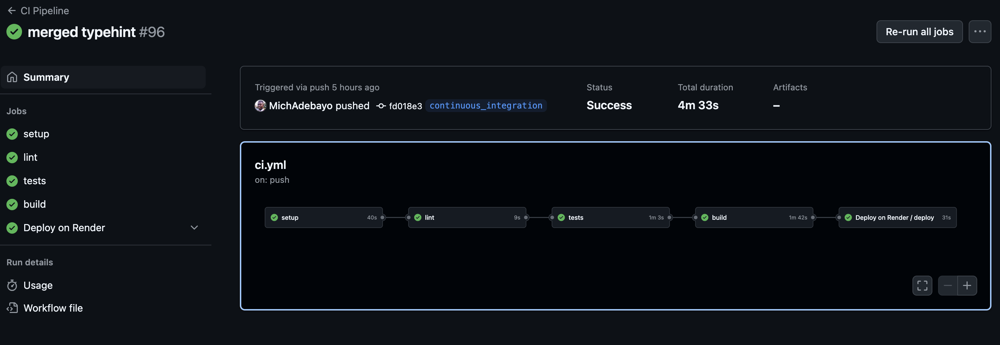
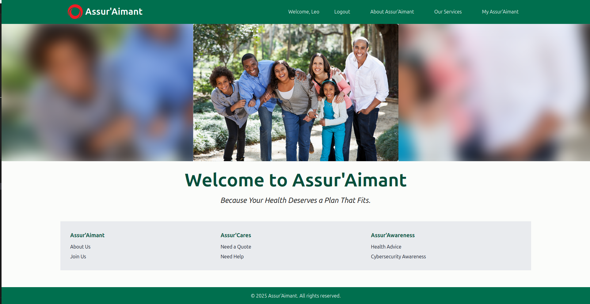

# Assur'Aimant: CI/CD & MLOps for a Data AI Project 🚀

[](https://github.com/MichAdebayo/brief_django_application/actions/workflows/ci.yml)
[](https://www.python.org/) [](https://www.djangoproject.com/) [](https://opensource.org/licenses/MIT)

---



> **Assur'Aimant** is a professional Django application for insurance premium prediction. This project builds on the initial application built, integrating a complete CI/CD pipeline and MLOps best practices to ensure quality, reproducibility, and continuous deployment of ML/AI models.

---

## 🖼️ Application Preview



---

## 📋 Table of Contents
- [Context & Objectives](#context--objectives)
- [Features](#features)
- [CI/CD & MLOps Strategy](#cicd--mlops-strategy)
- [Installation & Launch](#installation--launch)
- [Project Structure](#project-structure)
- [Security & Quality](#security--quality)
- [Contributing](#contributing)
- [Authors](#authors)
- [License](#license)

---

## 🎯 Context & Objectives

As a Data AI Developer, this project aims to:
- Automate integration, validation, and deployment of AI models (CI/CD, MLOps)
- Ensure quality through automated tests covering the entire model lifecycle
- Deploy the model reliably and reproducibly

---

## 🚀 Features

- 🔒 Secure authentication & profile management
- 🤖 Insurance premium prediction
- 🧪 Automated tests on data, pipelines, training, evaluation
- 🛠️ CI pipeline (linting, tests, Docker build)
- 🚢 Continuous delivery (CD) with Docker & automated deployment (on Render)
- 📱 Responsive UI (Tailwind CSS)
- 🗃️ Prediction history & appointment management

---

## 🔄 CI/CD & MLOps Strategy

### 1. **Automated Tests**
- Data validation (columns, types, missing values/outliers)
- Data preparation tests (cleaning, scikit-learn pipelines)
- Training tests (convergence, hyperparameters, performance thresholds)
- Evaluation tests (metrics, bias checks)
- Tools: `pytest`, `pytest-cov`, `pytest-mock`, `flake8`, `black`, `mypy`

### 2. **CI Pipeline**
- Linting, formatting, type checking
- Running unit & integration tests
- Automated Docker build
- CI status badge in the README
- Workflows: `.github/workflows/ci.yml`

### 3. **Continuous Delivery**
- Model packaging via Docker (`Dockerfile`)
- Versioning by tag or commit SHA
- Publishing to registry (Docker Hub, GitHub Container Registry)
- Automatic deployment to staging, production on tag/approval (Render)
- Monitoring & rollback


---

## ⚙️ Installation & Launch

### Prerequisites
- Python 3.9+
- pip
- Node.js (for Tailwind CSS)
- Docker

### Quick Setup
```bash
# Clone the repo
git clone https://github.com/MichAdebayo/brief_django_application.git
cd brief_django_application

# Virtual environment
python -m venv venv
source venv/bin/activate  # Linux/MacOS
venv\Scripts\activate   # Windows

# Python dependencies
pip install -r requirements.txt

# Frontend dependencies (for Tailwind)
npm install -D tailwindcss postcss autoprefixer
npx tailwindcss init -p

# Migrations & admin
python src/brief_app/manage.py makemigrations
python src/brief_app/manage.py migrate
python src/brief_app/manage.py createsuperuser

# Start the server
python src/brief_app/manage.py runserver
```

### Run tests & local CI
```bash
flake8 src/
black --check src/
mypy src/
pytest --maxfail=1 --disable-warnings -v
```

### Build & run Docker
```bash
docker build -t assur-aimant:latest .
docker run -p 8000:8000 assur-aimant:latest
```

---

## 🗂️ Project Structure

```
brief_django_application/
├── src/
│   ├── brief_app/
│   │   ├── manage.py
│   │   ├── brief_app/
│   │   │   ├── settings.py
│   │   │   ├── urls.py
│   │   │   └── ...
│   │   ├── insurance_app/
│   │   │   ├── model/
│   │   │   ├── static/images/web-screenshot-1.png
│   │   │   ├── templates/
│   │   │   ├── forms.py, models.py, views.py, ...
│   │   ├── theme/
│   │   └── ...
├── tests/
├── Dockerfile
├── requirements.txt
├── .github/workflows/ci.yml
├── README.md
└── ...
```

---

## 🛡️ Security & Quality
- Password hashing (PBKDF2)
- CSRF protection
- Input validation
- Automated linting, formatting, type checking
- Automated tests for the entire model lifecycle

---

## 🤝 Contributing

1. Create a branch:
   ```bash
   git checkout -b feature/my-feature
   ```
2. Commit:
   ```bash
   git commit -m "Add my feature"
   ```
3. Push:
   ```bash
   git push origin feature/my-feature
   ```
4. Open a Pull Request

---

## 👨‍💻 Authors
- [Michael Adebayo](https://github.com/MichAdebayo/)
- [Eliandy Rymer](https://github.com/EliandyDumortier/)

---

## 📄 License

Project under MIT License.
